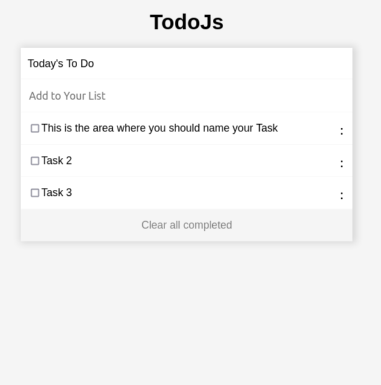

# TodoListJs

> Milestone 1 : A simple HTML list of To Do tasks. will be built using webpack and served by a webpack dev server.

> Milestone 2 : Add some interactive functionality. The user will also be able to mark task completion by selecting the corresponding checkbox (or undo it by unchecking the checkbox). The updated tasks list will be stored in local storage.

> Milestone 3 : to come later

> Milestone 4 : to come later

## Screenshot

## Built With

- HTML & CSS
- JavaScript

## Install

- From your terminal enter the following in order :  
  - `git clone https://github.com/od-c0d3r/todoJs.git`
  - `code todoJs`
  - `npm i`
  - `npm run start`

## Authors

👤 **Omar R.**

- GitHub: [@od-c0d3r](https://github.com/od-c0d3r)
- LinkedIn: [omarrashad](https://linkedin.com/in/omarrashad)

## 🤝 Contributing

Contributions, issues, and feature requests are welcome!

Feel free to check the [issues page](../../issues/).

## Show your support

Give a ⭐️ if you like this project!

## 📝 License

This project is [MIT](./doc/MIT.md) licensed.
